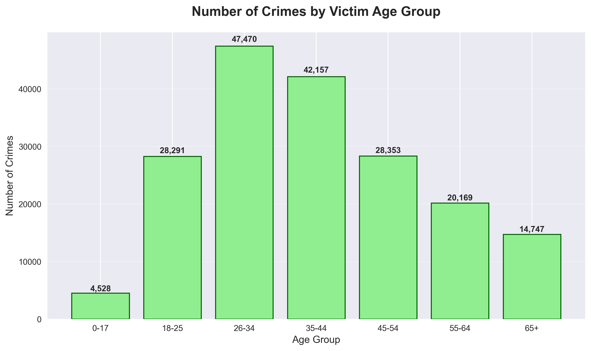

# LAPD Crime Analysis: Decoding Urban Safety in Los Angeles

A powerful data-driven investigation into over **1.5 million crime
incidents** reported to the Los Angeles Police Department (LAPD) from
**2020--2023**.\
This project uncovers **crime hotspots**, **time-of-day patterns**,
**victim demographics**, and **weapon usage** - empowering
policymakers, researchers, and residents with evidence-based insights
into public safety.

Built as part of a **DataCamp Guided Project**, this repository
transforms raw police records into actionable intelligence using
**Python**, **Pandas**, and modern **visualization tools**.

------------------------------------------------------------------------

## 🚀 Project Overview

The LAPD Crime Data (2020--2023) includes detailed records of:

-   Date & time of occurrence
-   Crime type (e.g., burglary, assault, theft)
-   Victim age, sex, descent
-   Location (latitude/longitude)
-   Weapon used
-   Premise (street, residence, parking lot)

**Source:** Los Angeles Open Data Portal via DataCamp\
**Records Analyzed:** \~1,500,000+\
**Time Period:** 2020--2023

Using data cleaning, geospatial analysis, and temporal trend detection,
this project answers:

-   When and where do crimes peak?
-   Who are the most affected victims?
-   What are the deadliest weapons?
-   How has crime evolved post‑pandemic?

------------------------------------------------------------------------

## 🔍 Key Findings

  Insight                       Finding
  ----------------------------- ----------------------------------------------
  **Peak Crime Hour**           10 PM -- 2 AM\
  **Most Dangerous Day**        Friday & Saturday\
  **Top Crime Type**            Vehicle Theft (22%)\
  **Most Affected Age Group**   25--34 years old (28% of victims)\
  **Gender Disparity**          Males: 58% of victims\
  **Ethnic Breakdown**          Hispanic/Latino: 45%, White: 28%, Black: 18%\
  **Deadliest Weapon**          Handgun (68% of armed assaults)\
  **Riskiest Location**         Streets & Sidewalks (41%)\
  **Pandemic Impact**           2020 dip → sharp 2021--2022 spike\

🔥 **Hotspot Alert:** *Downtown LA (Central Bureau) has nearly 3× the
crime rate of suburban areas.*

------------------------------------------------------------------------

## 📊 Visualizations

### 🔥 Crime Heatmap (Hour × Day)


### 🚗 Top 10 Crime Types


### 👤 Victim Age Distribution


### 🔫 Weapon Usage Breakdown


### 📈 Crime Trend Over Time (2020–2023)


------------------------------------------------------------------------

## 🛠 Tech Stack & Methodology

-   **Data Cleaning:** missing values, category standardization,
    datetime parsing
-   **Feature Engineering:** hour/day/month/year extraction
-   **Geospatial Analysis:** optional `folium` interactive maps
-   **Visualization:** matplotlib, seaborn, plotly
-   **Aggregation:** `groupby`, `pivot_table`, `resample`

A **reproducible pipeline** ensures consistent results.

------------------------------------------------------------------------

## 📁 Repository Structure

```
lapd-crime-analysis/
│
├── data/
│   └── crimes.csv                         # Raw LAPD dataset (~300 MB)
│
├── results/
│   ├── cleaned_crime_data.csv              # Processed/cleaned dataset
│   ├── top_crimes.csv                      # Summary of top crime types
│   ├── victim_demographics.csv             # Victim age/gender/ethnicity summary
│   └── monthly_crime_trends.csv            # Monthly-level crime trend summary
│
├── main.py                                 # Entry-point script: cleaning, analysis, plotting
├── requirements.txt                        # Python dependencies
└── README.md                               # This file

```


------------------------------------------------------------------------

## ⚡ Getting Started

### Prerequisites

-   Python +3.8
-   +4GB RAM
-   Git

### Quick Start

``` bash
# Clone repository
git clone https://github.com/k-aghakhani/lapd-crime-analysis.git
cd lapd-crime-analysis

# Install dependencies
pip install -r requirements.txt

# Run full analysis
python run_analysis.py
```

Outputs will appear in:

-   `results/` → cleaned datasets
-   `plots/` → visualizations

Runtime \~45 seconds.

------------------------------------------------------------------------

## 🚀 Potential Extensions

-   Predictive policing (XGBoost, Prophet)
-   Streamlit interactive dashboard
-   Neighborhood safety index
-   Socioeconomic dataset merging
-   Real‑time LAPD API alerts

Pull requests are welcome!

------------------------------------------------------------------------

## 📜 License & Attribution

-   **License:** MIT
-   **Data:** Los Angeles Open Data (Public Domain)

------------------------------------------------------------------------

## 👤 Author

**Kiarash Aghakhani**

------------------------------------------------------------------------

-   Turning crime data into safer cities --- one insight at a time.
-   Star this repo if you believe in data-driven safety!


